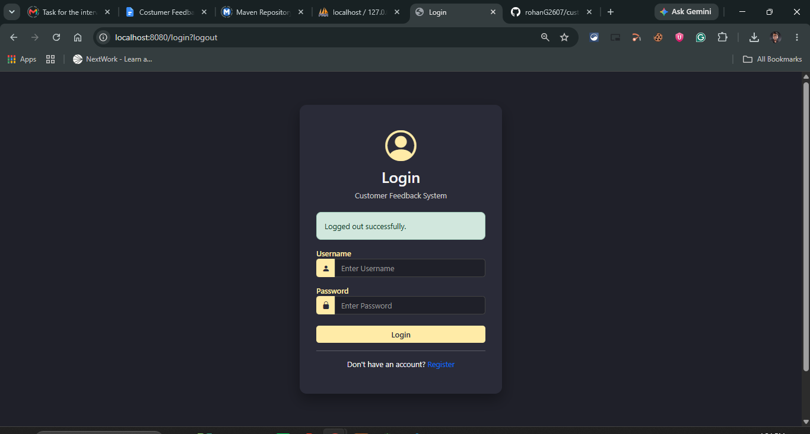
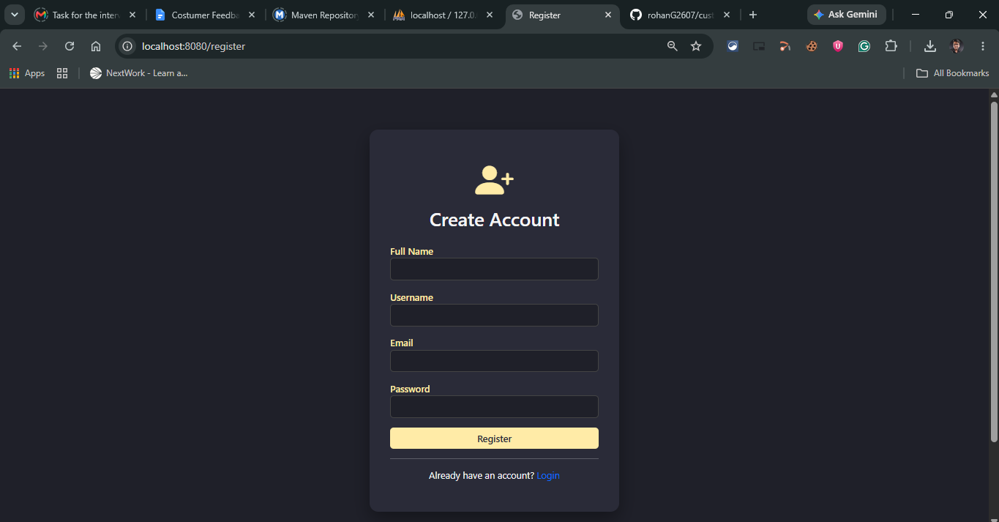
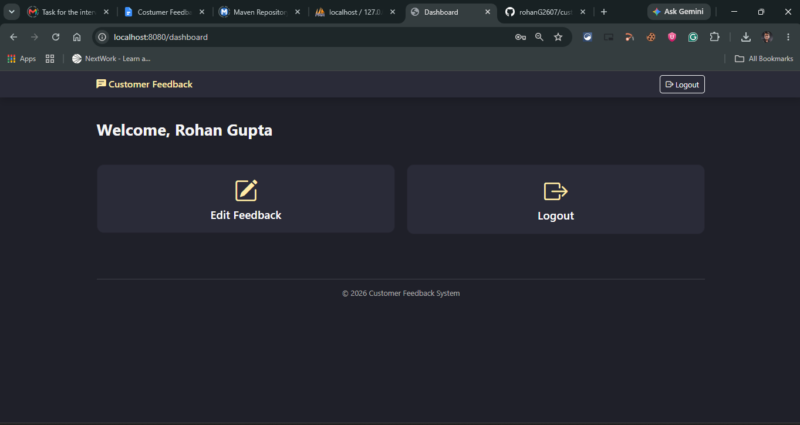
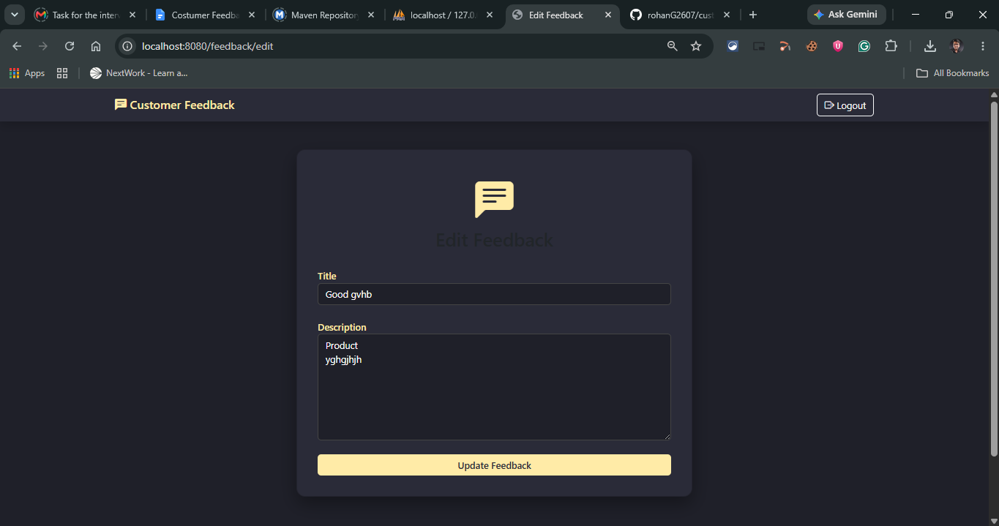
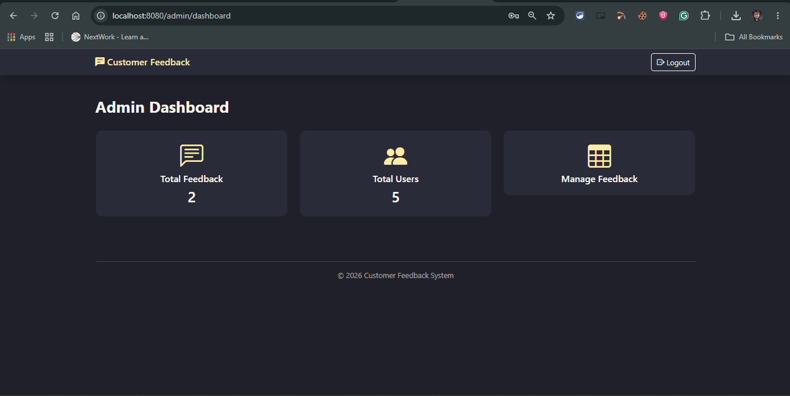
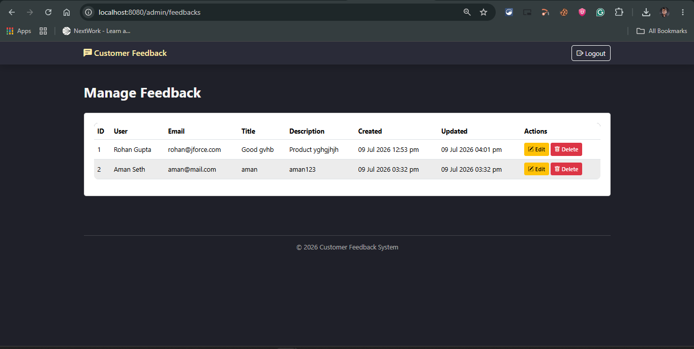

# Customer Feedback Management System

## Introduction

Customer Feedback Management System is a Spring Boot web application developed to learn the fundamentals of Spring Boot, Spring Security, Thymeleaf, and MySQL.

The application allows users to register, log in, submit a feedback, and update it whenever required. An administrator has separate access to manage all user feedback through an admin dashboard.

---

## Features

- User Registration
- User Login
- BCrypt Password Encryption
- Spring Security Authentication
- Role-Based Authorization (USER & ADMIN)
- Submit Feedback
- Edit Own Feedback
- One Feedback Per User Restriction
- Admin Dashboard
- View All Feedback
- Edit Any Feedback
- Delete Feedback
- Custom Login Page
- Responsive User Interface
- Custom Error Pages (403, 404, 500)

---

# Tech Stack

| Category | Technology |
|----------|------------|
| **Backend** | Java 21, Spring Boot, Spring Security, Spring Data JPA |
| **Frontend** | Thymeleaf, HTML, CSS, Bootstrap 5, JavaScript |
| **Database** | MySQL (XAMPP) |
| **Security** | Spring Security, BCrypt Password Encoder |
| **Build Tool** | Maven |

---

# Project Structure

```text
CustomerFeedbackSystem
│
├── src
│   ├── main
│   │   ├── java
│   │   │   └── com.feedback
│   │   │       ├── config
│   │   │       ├── controller
│   │   │       ├── dto
│   │   │       ├── entity
│   │   │       ├── enums
│   │   │       ├── exception
│   │   │       ├── repository
│   │   │       ├── security
│   │   │       ├── service
│   │   │       └── CustomerFeedbackSystemApplication.java
│   │   │
│   │   └── resources
│   │       ├── static
│   │       │   ├── css
│   │       │   ├── images
│   │       │   └── js
│   │       │
│   │       ├── templates
│   │       │   ├── error
│   │       │   ├── fragments
│   │       │   ├── admin-dashboard.html
│   │       │   ├── admin-feedbacks.html
│   │       │   ├── dashboard.html
│   │       │   ├── feedback-form.html
│   │       │   ├── login.html
│   │       │   └── register.html
│   │       │
│   │       └── application.properties
│   │
│   └── test
│
├── pom.xml
├── mvnw
└── README.md
```

The project follows the MVC (Model-View-Controller) architecture to keep the code organized and easy to maintain.

---

# Database

The application uses two tables.

| Table | Description |
|--------|-------------|
| **users** | Stores user account details such as username, email, encrypted password, and role (USER or ADMIN). |
| **feedback** | Stores feedback submitted by users along with the submission date and user relationship. |

---

# Application Flow

1. A new user registers using the registration page.
2. The password is encrypted using BCrypt before being stored in the database.
3. The user logs in using the custom login page.
4. Spring Security authenticates the user and redirects them based on their role.
5. A USER can submit one feedback.
6. If feedback already exists, the user can edit it but cannot create another one.
7. An ADMIN logs in using admin credentials.
8. The admin dashboard displays all submitted feedback.
9. The admin can view, edit, or delete any feedback.
10. Flash messages notify users about successful or failed operations.
11. Custom error pages are displayed for unauthorized access or application errors.

---

# Screenshots

### Home / Login Page


### Registration Page


### User Dashboard


### Feedback Form


### Admin Dashboard


### Manage Feedback

---

# How to Run

### 1. Clone the Repository

```bash
git clone https://github.com/your-username/customer-feedback-system.git
```

---

### 2. Import into Eclipse

- Open Eclipse.
- Select **Import Existing Maven Project**.
- Choose the project folder.

---

### 3. Configure MySQL

- Start Apache and MySQL using XAMPP.
- Create a database in MySQL.

Example:

```sql
CREATE DATABASE customer_feedback_db;
```

---

### 4. Update `application.properties`

Configure your database credentials.

```properties
spring.datasource.url=jdbc:mysql://localhost:3306/customer_feedback_db
spring.datasource.username=root
spring.datasource.password=
```

---

### 5. Install Maven Dependencies

Right-click the project.

```
Maven
    ↓
Update Project
```

Or use:

```bash
mvn clean install
```

---

### 6. Run the Application

Run

```
CustomerFeedbackSystemApplication.java
```

as

```
Run As
    ↓
Spring Boot App
```

The application will start on:

```
http://localhost:8080
```

---

# User Roles

## USER

A normal user can:

- Register an account
- Log in
- Submit one feedback
- Edit their own feedback
- View their dashboard

---

## ADMIN

An administrator can:

- Log in using admin credentials
- Access the admin dashboard
- View all feedback
- Edit any user's feedback
- Delete feedback
- Manage submitted feedback

---

# Future Improvements

Some features that can be added in future versions include:

- Search feedback
- Pagination for feedback list
- Email notifications
- REST API for external clients
- User profile management
- Password reset functionality
- Feedback filtering and sorting

---

# Learning Outcomes

While building this project, I learned:

- How to build a web application using Spring Boot.
- How MVC architecture organizes application code.
- How Spring Security handles authentication and authorization.
- How BCrypt encrypts passwords before storing them.
- How to use Spring Data JPA for database operations.
- How to integrate Thymeleaf with Spring Boot.
- How to implement role-based access control.
- How to connect a Spring Boot application with MySQL using JPA.

---

# Author

**Name:** Rohan Gupta

**GitHub:** https://github.com/rohanG2607

**LinkedIn:** https://linkedin.com/in/rohan-gupta2607

---
